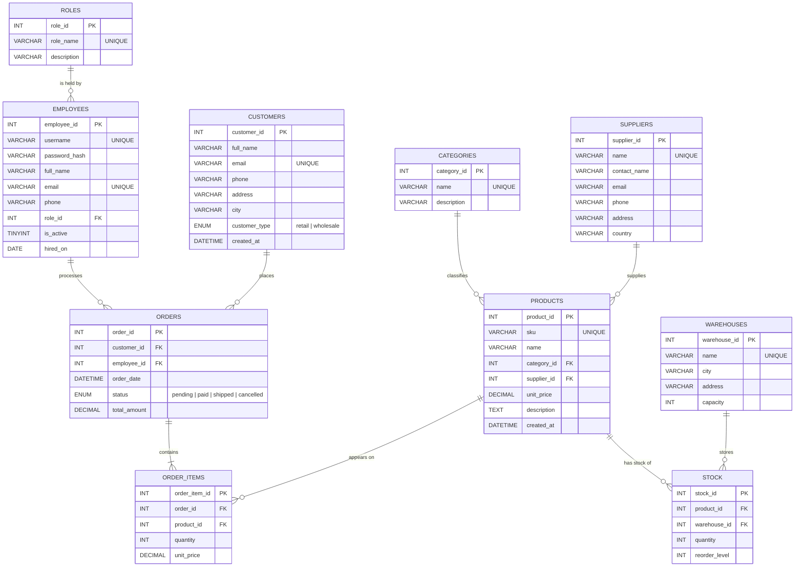

# ER Diagram

Entity-Relationship diagram for the Hardware Storage System.
Rendered with [Mermaid](https://mermaid.js.org/) — GitHub renders this
natively, or you can paste it into <https://mermaid.live>.

## Cardinalities

- A **role** is held by zero-or-more **employees**.
- An **employee** processes zero-or-more **orders**.
- A **customer** places zero-or-more **orders**.
- An **order** contains one-or-more **order items**.
- A **product** can appear on zero-or-more **order items**.
- A **category** classifies zero-or-more **products**.
- A **supplier** supplies zero-or-more **products**.
- A **product** can be stocked in zero-or-more **warehouses** (via `stock`),
  and a **warehouse** can store zero-or-more **products** (M:N resolved by the
  `stock` table).

## Notes on resolving M:N relationships

Two many-to-many relationships exist in the domain and are each resolved by
an associative (junction) table:

| Many-to-many                | Resolved by   |
|-----------------------------|---------------|
| products  ↔  warehouses     | `stock`       |
| orders    ↔  products       | `order_items` |
